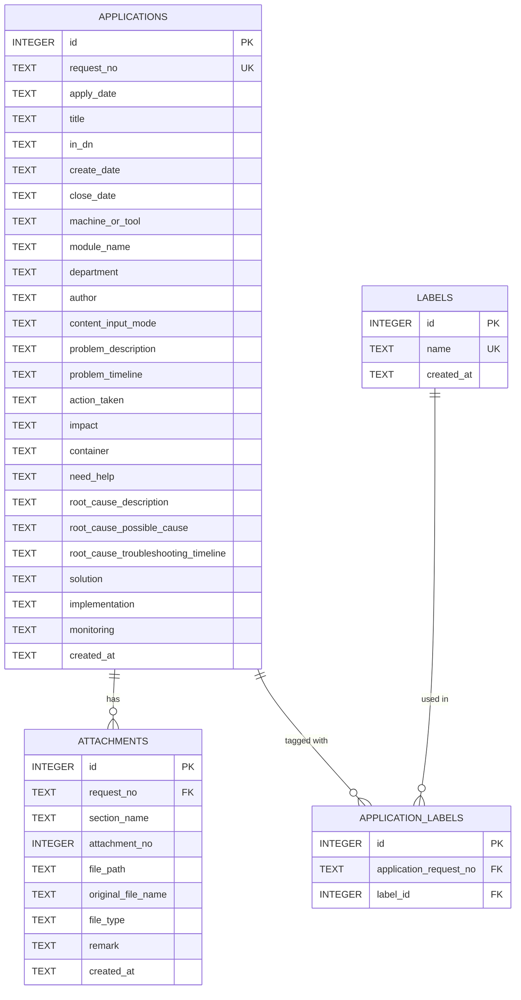
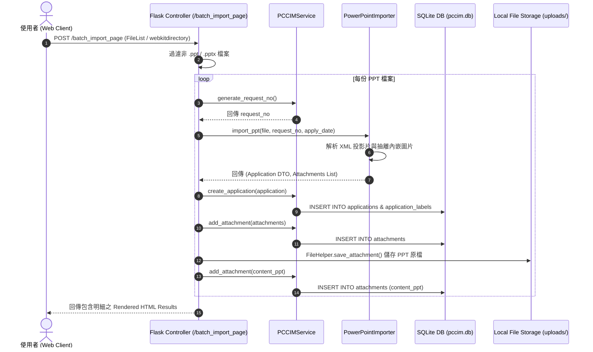
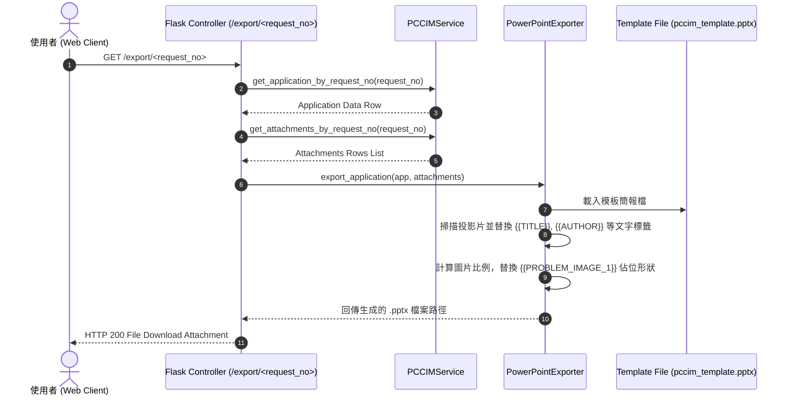

# PCCSIM 系統架構與設計模式說明文件 (ARCHITECTURE.md)

本文件詳細說明 PCCSIM (Problem Containment and Countermeasure System) 系統之軟體架構、設計模式、資料庫 Schema 以及模組間的資料流向。

---

## 1. 系統架構風格與設計模式 (Architectural Patterns)

PCCSIM 採用嚴謹的分層架構 (Layered Architecture)，搭配以下幾種核心設計模式以維護系統之擴充性、型別安全性與併發安全 (Concurrency Safety)：

```
+-------------------------------------------------------------+
|                Presentation / View Layer                   |
|  - HTML5 Templates (Jinja2) + Vanilla CSS                   |
|  - Dynamic Choices.js Multi-select UI Component            |
+-------------------------------------------------------------+
                              | (HTTP Request / Response)
                              v
+-------------------------------------------------------------+
|                  Controller / Route Layer                   |
|  - app.py (Flask Web Application Controller)                |
|  - Handles Input Validation & Request Forwarding            |
+-------------------------------------------------------------+
                              | (Dependency Injection)
                              v
+-------------------------------------------------------------+
|                 Service / Repository Layer                  |
|  - PCCIMService (Core Business Logic & Transactions)        |
|  - PowerPointImporter & PowerPointExporter (pptx Service)   |
+-------------------------------------------------------------+
                              | (SQLite Connection Factory)
                              v
+-------------------------------------------------------------+
|                   Data Access & DTO Layer                   |
|  - DatabaseManager (Thread-safe Connection Pool/Factory)    |
|  - Application & Attachment Models (Data Transfer Objects)  |
|  - SQLite Database File (pccim.db)                          |
+-------------------------------------------------------------+
```

### 1.1 Controller Layer (控制器層 - `app.py`)
* **權責**：作為 HTTP 請求之進入點，負責解析 URL 參數、Form Data 與 Upload Files，並將業務運算委派給 Service 層處理。
* **依賴注入 (Dependency Injection)**：`app.py` 在初始化時實例化 `DatabaseManager`，並將其注入至 `PCCIMService` 中。 Controller 不直接執行 SQL 語法，實現關注點分離 (Separation of Concerns)。

### 1.2 Service / Repository Layer (服務與儲存庫層 - `services/`)
* **`PCCIMService`**：封裝所有與 SQLite 互動之 CRUD 業務邏輯、交易控制與號碼生成算法 (`generate_request_no()`)。
* **`PowerPointImporter` & `PowerPointExporter`**：專門處理 XML 結構之 PowerPoint (.pptx) 檔案解析與生成。使用 `python-pptx` 搭配 `Pillow` 進行圖片之精確比例縮放與投影片形狀 (Shapes) 替換。

### 1.3 Factory Pattern (工廠模式 - `database/db_manager.py`)
* **非同步併發與線程安全 (Thread Safety)**：SQLite 在預設單執行緒模式下容易因線程共享連線而產生 `sqlite3.ProgrammingError`。`DatabaseManager` 採用 Factory Pattern，每次資料庫操作皆透過 `get_connection()` 建立獨立連線與自動鎖定，並在操作完成後於 `finally` 區塊強制關閉，防範資料庫連線洩漏 (Connection Leak)。

### 1.4 DTO Pattern (資料傳輸物件 - `models/`)
* **型別安全與結構約束**：`Application` 與 `Attachment` 類別全數導入 Python Type Hints，作為 Controller 與 Service 之間的標準傳輸資料結構 (DTO)，避免使用無型別約束之通用 Dict 造成執行階段 KeyError 崩潰。

---

## 2. 資料庫 schema 設計 (Database Schema)

資料庫採用 SQLite 嵌入式架構。為了確保資料完整性，啟用外鍵限制 (Foreign Key Constraints) 並建立了適當的 Index 索引。



### 2.1 資料表說明
1. **`applications` (申請單主表)**：儲存案件基本資訊（單號、作者、部門、標題）與各 8D 階段之文字描述。`request_no` 為唯一業務主鍵 (Business Primary Key)。
2. **`attachments` (附件資料表)**：紀錄案件關聯之圖片與 PPT 原檔路徑。與 `applications` 透過 `request_no` 進行關聯，外鍵設定為 `ON DELETE CASCADE`。
3. **`labels` (標籤主表)**：紀錄系統內所有可用的標籤名稱，`name` 欄位具備 `UNIQUE` 限制。
4. **`application_labels` (案件標籤關聯表)**：實作 `applications` 與 `labels` 之間的多對多 (Many-to-Many) 關聯。

---

## 3. 核心資料流程圖 (Data Flow Diagrams)

### 3.1 PPT 批次匯入流程 (Batch Import Flow)



### 3.2 PowerPoint 報告簡報匯出流程 (PPT Export Flow)


